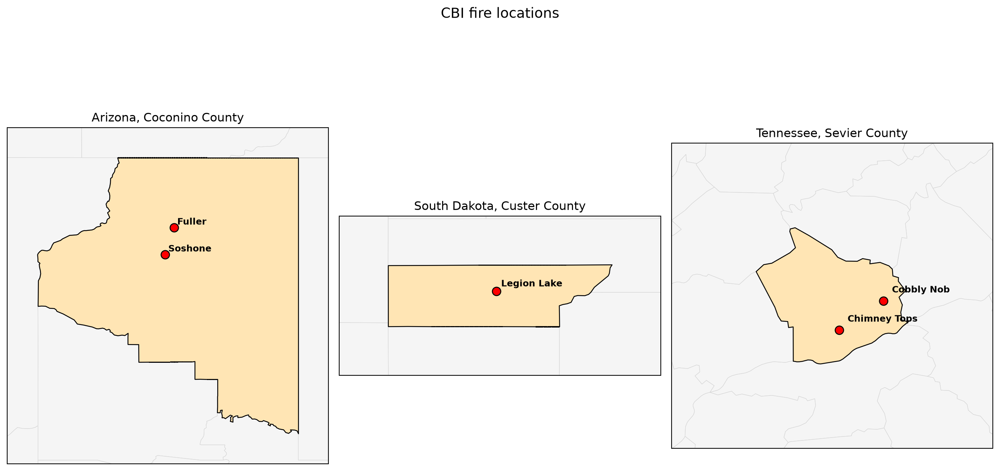
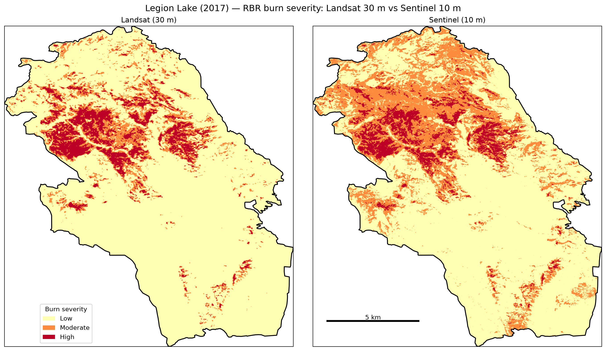
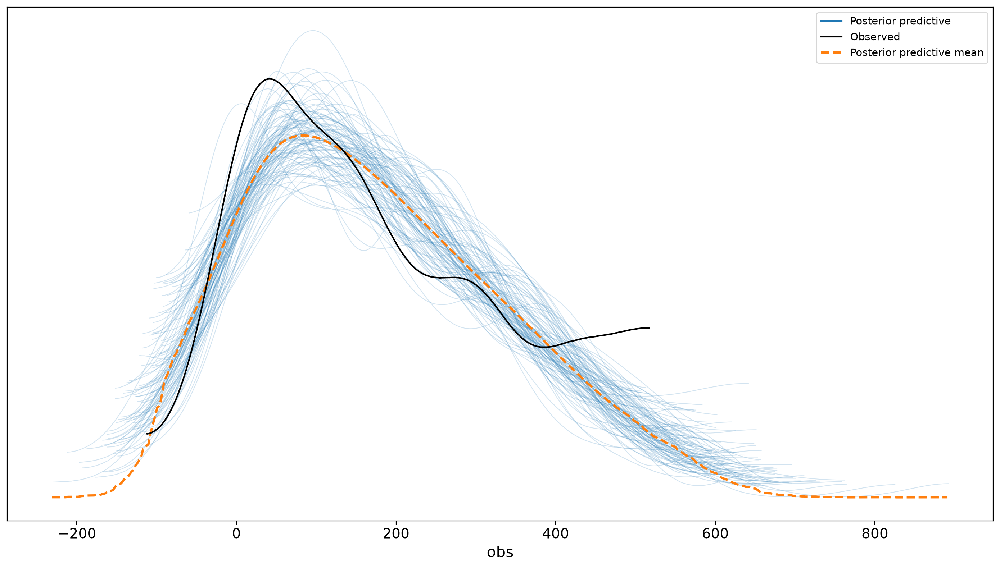

## Abstract

Understanding post-fire burn severity is essential for predicting ecosystem recovery, erosion, habitat change, and management needs. The Composite Burn Index (CBI) provides a field measure of ecological change, but field observations are too sparse to characterize most burned landscapes without satellite data. This study evaluated four satellite burn severity indices, dNBR, RBR, RdNBR, and RdNDVI, against CBI measurements from five fires in the United States. Landsat 8 Collection 2 surface reflectance imagery was processed for all five fires, and a direct comparison with Sentinel-2 imagery was conducted for Legion Lake, the only fire with suitable imagery from both sensors. RBR produced the strongest pooled relationship with CBI in this dataset, although index performance varied among fires. Landsat 8 and Sentinel-2 produced similar validation metrics at Legion Lake, while their mapped severity patterns differed at native output resolutions. The relationship between RBR and CBI was then evaluated with pooled, hierarchical, and hierarchical heteroscedastic Bayesian models. Plot-level cross-validation ranked both hierarchical models above the pooled model, suggesting that accounting for differences among fires improved prediction within the represented fires. The heteroscedastic model did not materially improve mean prediction, but posterior predictive checks showed that it represented the increase in residual variation at higher CBI values more accurately. These results show that variation among fires and across the severity gradient is an important component of satellite burn severity calibration and should be represented directly rather than summarized by a single pooled fit statistic.

## Introduction

Burn severity describes the magnitude of ecological change caused by fire and is widely used to understand post-fire vegetation recovery, erosion, habitat change, and management needs (Key & Benson, 2006; Miller et al., 2023). One of the most widely used field measures of burn severity is the Composite Burn Index (CBI). Within a 30 m diameter plot, observers visually rate fire effects across five strata, ranging from substrates and low vegetation to the upper forest canopy. Each stratum is scored on a continuous scale from 0, indicating no detectable change, to 3, indicating the most severe fire effects, and the scores are combined to produce a plot-level estimate of burn severity (Key & Benson, 2006). Although CBI plots provide detailed ecological information, field crews can sample only a small proportion of most burned landscapes because post-fire fieldwork is time-consuming, resource-intensive, and often conducted in remote or hazardous terrain (Miller et al., 2023).

Satellite remote sensing helps address these limitations by extending field observations across entire fire perimeters. Most satellite-derived measures of burn severity quantify changes in spectral reflectance between images collected before and after a fire. Key and Benson (2006) developed the differenced Normalized Burn Ratio, or dNBR, as part of the original CBI and remote-sensing framework. Miller and Thode (2007) later introduced the relative differenced Normalized Burn Ratio, or RdNBR, which scales spectral change according to pre-fire vegetation conditions. Parks et al. (2014) proposed the Relativized Burn Ratio, or RBR, as another method of accounting for variation in pre-fire vegetation. Howe et al. (2022) also evaluated a relativized differenced Normalized Difference Vegetation Index, or RdNDVI, which applies a similar relativization approach to changes in NDVI. These indices attempt to improve the relationship between satellite-observed spectral change and field-measured ecological effects, although their performance can vary among ecosystems, fires, sensors, and image-processing methods.

Howe et al. (2022) compared Sentinel-2 and Landsat 8 using 912 forested CBI plots from 26 fires that burned across western North America between 2016 and 2019. They evaluated dNBR, RBR, RdNBR, and RdNDVI using both manually selected image pairs and multi-image composites. Sentinel-2 generally performed as well as or better than Landsat 8, particularly when atmospherically corrected imagery was used. RdNBR produced the strongest overall relationship with CBI in the extended composite analysis, although RBR performed nearly as well. Howe et al. (2022) also found that spatial resolution affected the apparent configuration of high-severity fire. Sentinel-2 resolved more local variation and mapped less area as the interior of large high-severity patches than Landsat 8.

Most comparisons of burn-severity indices summarize model performance using measures such as the coefficient of determination and root-mean-square error. These statistics describe average performance but do not fully represent uncertainty in the CBI value predicted for an individual pixel. Similar spectral-index values can correspond to substantially different ecological effects because of variation among fires, vegetation communities, field plots, and satellite pixels. Harvey et al. (2019) used Bayesian hierarchical models to estimate relationships between satellite indices and individual field measures of fire effects, producing posterior distributions that represented uncertainty in pixel-level predictions. Furniss et al. (2020) similarly found wide ranges of observed tree mortality at equivalent Landsat index values, demonstrating that apparently precise burn-severity maps can conceal substantial ecological uncertainty. More broadly, Miller et al. (2023) concluded that uncertainty introduced throughout field sampling, image processing, index selection, and statistical modeling is rarely propagated fully into final burn-severity estimates.

This study uses the analytical framework of Howe et al. (2022) as a starting point while addressing a different set of objectives. It uses a smaller fire set, includes fires outside western North America, applies an updated Google Earth Engine workflow, and treats hierarchical Bayesian analysis as the central methodological contribution. The first objective is to evaluate the relationships of dNBR, RBR, RdNBR, and RdNDVI with field-measured CBI across the available fires. The second objective is to compare Landsat 8 and Sentinel-2 where suitable imagery from both sensors exists. The third objective is to determine whether explicitly modeling variation among fires and changes in residual variance across the CBI gradient improves calibration and uncertainty characterization.

## Methods

### Field data and fire selection

Field measurements of burn severity were obtained from the USGS national Composite Burn Index database (United States Geological Survey et al., 2024). The downloaded version of the database contained 6,279 CBI plots from 234 fires that burned between 1994 and 2017. Each observation included a plot location, fire date, and plot-level CBI value.

The Landsat analysis was restricted to fires that burned in 2016 or later, producing a study set of five fires. Sentinel-2 analysis was further restricted to fires that burned in 2017. This ensured that the year-before-fire composite used a complete June through September season from 2016. Earlier fires would have required imagery from the incomplete first summer of the Sentinel-2 archive.

Satellite imagery was processed in Google Earth Engine (Gorelick et al., 2017). Landsat imagery came from the Landsat 8 Collection 2, Tier 1 Level-2 archive, which provides atmospherically corrected surface reflectance at 30 m resolution. The near-infrared, shortwave-infrared, and red bands were obtained from SR_B5, SR_B7, and SR_B4, respectively. Digital numbers were converted to surface reflectance using a scale factor of 0.0000275 and an offset of −0.2. Pixels identified in the QA_PIXEL band as dilated cloud, cloud, or cloud shadow were excluded.

Sentinel-2 imagery came from the harmonized Level-1C archive. The near-infrared, shortwave-infrared, and red bands were obtained from B8, B12, and B4 and converted to top-of-atmosphere reflectance using a scale factor of 0.0001. Cloud and cloud-shadow contamination was removed using the Cloud Score+ `cs_cdf` band, retaining pixels with scores of at least 0.60 (Pasquarella et al., 2023).

The Sentinel-2 surface-reflectance archive in Earth Engine begins in March 2017 and therefore does not include the 2016 pre-fire imagery required for the fires analyzed here. Sentinel-2 top-of-atmosphere imagery was used instead. Consequently, the sensor comparison contrasts Landsat surface reflectance with Sentinel-2 top-of-atmosphere reflectance. Differences between sensors may therefore reflect atmospheric correction and preprocessing as well as sensor characteristics.

Forest cover was obtained from the 2015 Global Forest Cover Change tree-canopy product at 30 m resolution (Sexton et al., 2013; Townshend, 2016). Fire perimeters were obtained from Monitoring Trends in Burn Severity burned-area boundaries (Eidenshink et al., 2007) accessed through the Earth Engine community data catalog.

### Image compositing

For each fire and sensor, pre-fire and post-fire image collections were constructed using the extended-composite approach described by Howe et al. (2022). The pre-fire composite was the pixel-wise mean of all retained observations from June 1 through September 30 of the year before the fire. The post-fire composite used the same dates in the year after the fire. In Earth Engine, the period was implemented with an inclusive start date of June 1 and an exclusive ending date of October 1.

Mean compositing reduces dependence on an individual image and allows multiple clear observations to contribute to each pixel. However, it can also incorporate vegetation recovery occurring before or during the post-fire compositing season. The fixed window also matters for the three dormant-season fires. Chimney Tops and Cobbly Nob burned in late November 2016 and Legion Lake in December 2017, so their pre-fire composites came from the summer of the preceding year rather than the summer immediately before the fire, which lengthens the interval between pre-fire and post-fire imagery.

Howe et al. (2022) also evaluated a hybrid composite that included imagery acquired shortly after the fire and during the early growing season of the following year. That method was not implemented because the national CBI table did not contain the fire containment dates and local snowmelt information needed to apply fire-specific image windows consistently. The hybrid method was also developed primarily to reduce the effects of rapid post-fire green-up in boreal ecosystems.

### Burn-severity indices

Four remotely sensed burn-severity indices were calculated from the pre-fire and post-fire composites. The Normalized Burn Ratio and Normalized Difference Vegetation Index were calculated as

$$\mathrm{NBR} = \frac{\mathrm{NIR}-\mathrm{SWIR2}}{\mathrm{NIR}+\mathrm{SWIR2}}$$

and

$$\mathrm{NDVI} = \frac{\mathrm{NIR}-\mathrm{RED}}{\mathrm{NIR}+\mathrm{RED}}.$$

Changes between the pre-fire and post-fire composites were calculated as

$$\mathrm{dNBR} = (\mathrm{NBR}_{pre}-\mathrm{NBR}_{post})\times 1000$$

and

$$\mathrm{dNDVI} = (\mathrm{NDVI}_{pre}-\mathrm{NDVI}_{post})\times 1000.$$

The relativized indices were then calculated as

$$\mathrm{RBR} = \frac{\mathrm{dNBR}}{\mathrm{NBR}_{pre}+1.001},$$

$$\mathrm{RdNBR} = \frac{\mathrm{dNBR}}{\sqrt{\max(|\mathrm{NBR}_{pre}|,\,0.001)}},$$

and

$$\mathrm{RdNDVI} = \frac{\mathrm{dNDVI}}{\sqrt{\max(|\mathrm{NDVI}_{pre}|,\,0.001)}}.$$

The lower bound of 0.001 prevented division by zero or very small pre-fire index values. dNBR represents absolute spectral change, while RBR and RdNBR scale that change relative to pre-fire vegetation conditions. RdNDVI applies an equivalent relativization to changes in vegetation greenness. No dNBR offset (Parks et al., 2014) was applied. Howe et al. (2022) tested the offset with composite imagery and found that it reduced correspondence with CBI.

Landsat bands used in these calculations have a spatial resolution of 30 m. Sentinel-2 B8 and B4 have native resolutions of 10 m, while B12 has a native resolution of 20 m. Sentinel RdNDVI can therefore be represented at a true 10 m resolution. The Sentinel NBR-derived indices, including dNBR, RBR, and RdNBR, are represented on a 10 m output grid but contain a SWIR2 band resampled from 20 m. They are consequently described as pseudo-10 m products rather than native 10 m products (Howe et al., 2022).

### Plot extraction and forest masking

Burn-severity indices and canopy cover were sampled at the center coordinates of each CBI plot. Values from both Landsat and Sentinel-2 were extracted at a common sampling scale of 30 m. Using the same sampling scale made the statistical comparison more consistent with the approximately 30 m diameter CBI plots and avoided comparing observations extracted using different pixel supports. Each value is a single sample at the plot center rather than an average over the plot area, which differs from Howe et al. (2022), who used area-weighted pixel values within a 15 m radius of each plot center.

The use of a 30 m sampling scale means that the validation analysis does not evaluate Sentinel-2 indices at their finer output resolution. The 10 m Sentinel grid was used only for the mapped spatial comparison.

Plots were classified as forested when canopy cover in the 2015 Global Forest Cover Change layer was at least five percent, following Howe et al. (2022). Plots below this threshold and plots lacking an index value because of cloud masking or missing imagery were excluded.

### Index validation

The relationship between each spectral index and field-measured CBI was evaluated using ordinary least-squares regression:

$$\mathrm{CBI}_i = \beta_0+\beta_1 X_i+\epsilon_i,$$

where $X_i$ was dNBR, RBR, RdNBR, or RdNDVI at plot $i$. Separate regressions were fitted for each sensor. This validation regresses CBI on the index, so its error is expressed on the CBI scale and is comparable across indices. This is the inverse of the calibration and Bayesian models described below, which treat the index as the response; because the coefficient of determination is identical in either direction for a simple linear regression, the ranking of indices is unaffected. Howe et al. (2022) instead calculated R² from their nonlinear calibration models, so the values reported here are not directly comparable with theirs.

Model performance was summarized using the coefficient of determination, $R^2$, and root-mean-square error on the CBI scale. Metrics were calculated both across all available plots and separately for each fire. The pooled analysis gives greater influence to fires containing more CBI plots, while estimates for fires with small sample sizes are comparatively unstable. Per-fire results were therefore used primarily to examine variation among fires rather than to rank indices conclusively.

### Severity classification and mapping

RBR was selected for the mapped comparison based on its performance in the validation analysis. Continuous RBR values were converted to categorical severity classes using the nonlinear calibration approach applied by Howe et al. (2022). For each sensor, the following exponential model was fitted by nonlinear least squares:

$$\mathrm{RBR} = a+b\exp(c\,\mathrm{CBI}).$$

The fitted curve was evaluated at CBI values of 1.25 and 2.25. These values define the boundaries between low, moderate, and high burn severity. The corresponding fitted RBR values were used as sensor-specific classification thresholds.

RBR rasters were classified into low, moderate, and high severity, clipped to the associated MTBS fire perimeter, and exported for mapping. Landsat maps were exported at 30 m. Sentinel maps were exported on a 10 m grid, although Sentinel RBR should be interpreted as pseudo-10 m because its SWIR2 input has a native resolution of 20 m.

The Landsat thresholds were fitted to plots from all five fires, whereas the Sentinel-2 thresholds were fitted to Legion Lake alone, the only fire with Sentinel-2 data. Because separate calibration curves were fitted for Landsat and Sentinel-2, mapped differences can reflect differences in calibration, atmospheric processing, cloud masking, and sensor characteristics in addition to spatial resolution. The Landsat and Sentinel maps therefore provide a practical comparison of the complete processing workflows but do not isolate spatial resolution as the sole cause of differences between maps.

### Implementation

```{python}
#| label: setup
#| code-summary: "Setup and imports"
import ee
import numpy as np
import pandas as pd
import geopandas as gpd
from scipy import stats
from scipy.optimize import curve_fit
import matplotlib.pyplot as plt
import requests
import rasterio
from rasterio.features import geometry_mask
import cartopy.crs as ccrs
import cartopy.io.shapereader as shpreader
from matplotlib.colors import ListedColormap
from matplotlib.patches import Patch

ee.Initialize(project="howe-et-al")
```

```{python}
#| label: functions
#| code-summary: "Pipeline functions"
def gdf_to_ee(gdf):
    # convert a GeoDataFrame of CBI plots to an ee.FeatureCollection (pure ee, no geemap)
    feats = [ee.Feature(ee.Geometry.Point([g.x, g.y]), {'Cbi': c})
             for g, c in zip(gdf.geometry, gdf['Cbi'])]
    return ee.FeatureCollection(feats)

def composite(collection, year):
    # extended-composite window: Jun 1 – Sep 30 (EE end date is exclusive, so 10-01 includes Sep 30)
    return collection.filterDate(f'{year}-06-01', f'{year}-10-01').mean()

def nbr(img):
    return img.normalizedDifference(['NIR', 'SWIR2']).rename('NBR')

def ndvi(img):
    return img.normalizedDifference(['NIR', 'RED']).rename('NDVI')

def nls_model(cbi, a, b, c):
    # exponential calibration form of Howe et al. (2022): index = a + b * exp(c * CBI)
    return a + b * np.exp(c * cbi)

def fc_to_df(fc):
    feats = fc.getInfo()['features']
    df = pd.DataFrame([f['properties'] for f in feats])
    return df.apply(pd.to_numeric, errors='coerce')

def add_indices(pre, post):
    nbr_pre, nbr_post = nbr(pre), nbr(post)
    dnbr  = nbr_pre.subtract(nbr_post).multiply(1000).rename('dNBR')
    rbr   = dnbr.divide(nbr_pre.add(1.001)).rename('RBR')
    rdnbr = dnbr.divide(nbr_pre.abs().max(0.001).sqrt()).rename('RdNBR')
    ndvi_pre, ndvi_post = ndvi(pre), ndvi(post)
    dndvi  = ndvi_pre.subtract(ndvi_post).multiply(1000)
    rdndvi = dndvi.divide(ndvi_pre.abs().max(0.001).sqrt()).rename('RdNDVI')
    return ee.Image([dnbr, rbr, rdnbr, rdndvi])

def sensor(fire_ee, name):
    def landsat():
        def prep(img):
            qa = img.select('QA_PIXEL')
            mask = (qa.bitwiseAnd(1 << 1).eq(0)
                      .And(qa.bitwiseAnd(1 << 3).eq(0))
                      .And(qa.bitwiseAnd(1 << 4).eq(0)))
            out = (img.select(['SR_B5', 'SR_B7', 'SR_B4'], ['NIR', 'SWIR2', 'RED'])
                      .multiply(0.0000275).add(-0.2).updateMask(mask))
            return out.copyProperties(img, ['system:time_start'])
        return ee.ImageCollection("LANDSAT/LC08/C02/T1_L2").filterBounds(fire_ee).map(prep)

    def sentinel():
        cs = ee.ImageCollection('GOOGLE/CLOUD_SCORE_PLUS/V1/S2_HARMONIZED')
        def prep(img):
            mask = img.select('cs_cdf').gte(0.6)
            out = (img.select(['B8', 'B12', 'B4'], ['NIR', 'SWIR2', 'RED'])
                      .multiply(0.0001).updateMask(mask))
            return out.copyProperties(img, ['system:time_start'])
        return (ee.ImageCollection("COPERNICUS/S2_HARMONIZED")
                  .filterBounds(fire_ee).linkCollection(cs, ['cs_cdf']).map(prep))

    return landsat() if name == 'landsat' else sentinel()

def run_fire(fire, name):
    fire_gdf = CBI[CBI['FireName'] == fire].to_crs(4326)
    fire_ee  = gdf_to_ee(fire_gdf)
    year     = pd.to_datetime(fire_gdf['FireDate'].iloc[0]).year
    col  = sensor(fire_ee, name)
    pre  = composite(col, year - 1)
    post = composite(col, year + 1)
    indices = add_indices(pre, post)
    # both sensors sampled at a common 30 m scale (isolates spectral/atmospheric differences,
    # not Sentinel's finer resolution: that appears only in the maps)
    samples = indices.addBands(canopy).sampleRegions(
        collection=fire_ee, properties=['Cbi'], scale=30)
    df = fc_to_df(samples).query('canopy >= 5')
    df['fire'], df['sensor'] = fire, name
    return df

def results(df, by_fire=False):
    index_names = ["dNBR", "RBR", "RdNBR", "RdNDVI"]
    def score(sub):
        rows = []
        for idx in index_names:
            s, i, r, p, se = stats.linregress(sub[idx], sub["Cbi"])
            pred = s * sub[idx] + i
            rmse = np.sqrt(np.mean((sub["Cbi"] - pred) ** 2))
            rows.append({"index": idx, "R2": r**2, "RMSE": rmse, "n": len(sub)})
        return pd.DataFrame(rows)
    if not by_fire:
        return score(df).round(3)
    out = [score(sub).assign(fire=fire) for fire, sub in df.groupby("fire")]
    return pd.concat(out, ignore_index=True).round(3)

def journal_style(styler):
    # clean journal aesthetic (à la Howe et al.): horizontal rules only, centered cells,
    # no vertical lines and no row shading
    return styler.set_table_styles([
        {'selector': '', 'props': [('border-collapse', 'collapse'),
                                   ('margin', '0.6em auto'), ('font-size', '0.95em')]},
        {'selector': 'th, td', 'props': [('border', 'none'), ('padding', '4px 16px'),
                                         ('text-align', 'center'), ('background', 'none')]},
        {'selector': 'thead th', 'props': [('font-weight', 'bold')]},
        {'selector': 'thead tr:first-child th', 'props': [('border-top', '1.5px solid #222')]},
        {'selector': 'thead tr:last-child th', 'props': [('border-bottom', '1px solid #222')]},
        {'selector': 'tbody tr:last-child td, tbody tr:last-child th', 'props': [('border-bottom', '1.5px solid #222')]},
    ], overwrite=False)
```

```{python}
#| label: data
#| code-summary: "Load field data and layers"
CBI = gpd.read_file("cbi_data_review_v4/conus_cbi_v4.shp")
CBI['year'] = pd.to_datetime(CBI['FireDate'], errors='coerce').dt.year

canopy = (ee.ImageCollection('NASA/MEASURES/GFCC/TC/v3')
            .filterDate('2015-01-01', '2015-12-31')
            .select('tree_canopy_cover').mosaic().rename('canopy'))

mtbs = ee.FeatureCollection('projects/sat-io/open-datasets/MTBS/burned_area_boundaries')
```

### Hierarchical Bayesian calibration

The Landsat RBR and CBI relationship was modeled using three Bayesian models of increasing complexity. Landsat was used because it provided observations from all five fires.

The first model was a Bayesian version of the pooled nonlinear calibration used by Howe et al. (2022):

$$\mathrm{RBR}_i \sim \mathrm{Normal}(\mu_i,\sigma),$$

$$\mu_i = a+b\exp(c\,\mathrm{CBI}_i).$$

Weakly informative priors were assigned as follows:

$$a\sim\mathrm{Normal}(0,50),$$

$$b\sim\mathrm{HalfNormal}(50), \qquad c\sim\mathrm{HalfNormal}(1),$$

and

$$\sigma\sim\mathrm{HalfNormal}(100).$$

The second model introduced a fire-specific intercept:

$$\mu_i = a_{j[i]}+b\exp(c\,\mathrm{CBI}_i),$$

where $j[i]$ identifies the fire associated with observation $i$. Fire-level intercepts were specified using a non-centered hierarchical parameterization:

$$a_j = \mu_a+\sigma_a z_j,$$

$$z_j\sim\mathrm{Normal}(0,1),$$

$$\mu_a\sim\mathrm{Normal}(0,50), \qquad \sigma_a\sim\mathrm{HalfNormal}(50).$$

This structure partially pools information among fires. Fires with few observations are regularized toward the overall intercept, while fires with more observations can support larger deviations.

The third model retained the fire-specific intercepts but allowed residual variation to change with CBI:

$$\sigma_i = \exp(d+e\,\mathrm{CBI}_i),$$

with

$$d\sim\mathrm{Normal}(4,1)$$

and

$$e\sim\mathrm{Normal}(0,1).$$

A positive value of $e$ indicates that residual variation in RBR increases with field-measured severity. The exponential link ensures that the modeled standard deviation remains positive.

Models were fitted in PyMC (Abril-Pla et al., 2023) using the No-U-Turn Sampler. Four Markov chains were run, each with 1,000 tuning iterations followed by 1,000 retained posterior draws. Sampling used a target acceptance probability of 0.95 and a random seed of 42. Convergence was evaluated using trace plots, split-$\hat{R}$, effective sample sizes, and the number of divergent transitions.

Predictive performance was compared using Pareto-smoothed importance-sampling leave-one-out cross-validation (Vehtari et al., 2017), implemented through ArviZ (Kumar et al., 2019). Posterior predictive checks were used to compare repeat RBR distributions with the observed data and to evaluate whether the likelihood adequately represented changes in residual variation.

The leave-one-out comparison operates at the individual-plot level. In the hierarchical models, the intercept for a held-out plot's fire remains informed by the other plots from that fire. The resulting scores therefore estimate predictive performance for additional plots from fires represented in the calibration dataset. They do not directly measure transferability to a completely unobserved fire, which would require leave-one-fire-out or grouped cross-validation.

In-sample $R^2$ and RMSE were also calculated on the RBR scale using the posterior mean of each fire-specific expected value. These statistics describe conditional model fit and were not used as substitutes for cross-validated predictive performance.

The Bayesian models preserve the calibration direction used in the nonlinear least-squares analysis, with RBR treated as the response and CBI treated as the predictor. Their posterior predictive distributions therefore quantify uncertainty in RBR conditional on an observed CBI value. They do not directly estimate the posterior distribution of CBI conditional on a satellite-derived RBR value.

```{python}
#| label: bayes-model
#| eval: false
#| code-summary: "Final Bayesian model: nonlinear, hierarchical, heteroscedastic"
import pymc as pm
import arviz as az

cbi = landsat['Cbi'].values
rbr = landsat['RBR'].values
fire_idx, fire_labels = pd.factorize(landsat['fire'])
n_fires = len(fire_labels)
coords = {'fire': list(fire_labels)}   # names the per-fire dimension so plots label by fire

with pm.Model(coords=coords) as m_het:
    mu_a     = pm.Normal('mu_a', mu=0, sigma=50)                 # global baseline
    sigma_a  = pm.HalfNormal('sigma_a', sigma=50)               # between-fire spread
    a_offset = pm.Normal('a_offset', mu=0, sigma=1, dims='fire')     # non-centered
    a = pm.Deterministic('a', mu_a + a_offset * sigma_a, dims='fire')  # per-fire intercepts

    b = pm.HalfNormal('b', sigma=50)                            # shared curve shape
    c = pm.HalfNormal('c', sigma=1)

    d = pm.Normal('d', mu=4, sigma=1)                           # baseline log-scatter
    e = pm.Normal('e', mu=0, sigma=1)                           # scatter vs severity
    sigma = pm.Deterministic('sigma', pm.math.exp(d + e * cbi))

    mu = a[fire_idx] + b * pm.math.exp(c * cbi)
    pm.Normal('obs', mu=mu, sigma=sigma, observed=rbr)
    idata_het = pm.sample(1000, tune=1000, chains=4, random_seed=42,
                          target_accept=0.95, idata_kwargs=dict(log_likelihood=True))
```

## Results

```{python}
#| label: run
#| code-summary: "Run the validation pipeline"
fire_list = CBI.loc[CBI['year'] >= 2016, 'FireName'].unique()
landsat = pd.concat([run_fire(f, 'landsat') for f in fire_list], ignore_index=True)

s2_fires = CBI.loc[CBI['year'] >= 2017, 'FireName'].unique()
sentinel = pd.concat([run_fire(f, 'sentinel') for f in s2_fires], ignore_index=True)
```

### Pooled and fire specific index performance

Across all Landsat plots (@tbl-pooled), RBR produced the highest pooled R² and the lowest RMSE among the four indices, while RdNBR produced the weakest pooled fit. The differences among the remaining indices were smaller, indicating that the principal contrast in the pooled analysis was between RBR and RdNBR rather than a uniform separation among all four indices.

```{python}
#| label: tbl-pooled
#| tbl-cap: "Model fit (R²) and root-mean-square error (RMSE, on the CBI scale) for the regression between field CBI and each burn-severity index, pooled across all five Landsat fires."
pooled = results(landsat).rename(columns={'index': 'Spectral index', 'R2': 'R²'})
journal_style(pooled.style.hide(axis='index').format({'R²': '{:.3f}', 'RMSE': '{:.3f}'}))
```

Index performance varied substantially among fires (@tbl-byfire). No single pooled value described the full set of relationships, and the weak pooled result for RdNBR was concentrated in particular fires rather than observed consistently across the dataset. Cobbly Nob contained only three plots and was therefore excluded from the separate fire regressions because estimates based on so few observations would be unstable. Its plots remained in the pooled analysis and in the hierarchical Bayesian models.

```{python}
#| label: tbl-byfire
#| tbl-cap: "Per-fire model fit (R²) and RMSE (on the CBI scale) for each burn-severity index, with fires as column groups (as in Howe et al. Table 5), ordered by number of plots. Cobbly Nob (three plots) is omitted, as a per-fire fit with so few points has too few degrees of freedom to be meaningful; it still contributes to the pooled analysis."
bf = results(landsat, by_fire=True)
bf = bf[bf['fire'] != 'Cobbly Nob']
n_by_fire = bf.groupby('fire')['n'].first().sort_values(ascending=False)
order = pd.MultiIndex.from_product([list(n_by_fire.index), ['R2', 'RMSE']])
piv = (bf.pivot(index='index', columns='fire', values=['R2', 'RMSE'])
         .swaplevel(axis=1)
         .reindex(columns=order)
         .loc[['dNBR', 'RBR', 'RdNBR', 'RdNDVI']]
         .rename(columns={'R2': 'R²'}, level=1)
         .rename(columns={f: f'{f} (n = {n})' for f, n in n_by_fire.items()}, level=0))
piv.index.name = 'Spectral index'
journal_style(piv.style.format('{:.3f}'))
```

### Sensor comparison at Legion Lake

Legion Lake was the only fire with suitable pre-fire and post-fire imagery from both sensors. Across the four indices, Landsat 8 and Sentinel-2 produced similar R² and RMSE values when both were sampled at 30 m (@tbl-compare). Landsat 8 had a small numerical advantage for most comparisons, but the differences were minor relative to the variation observed among fires. Because the validation used a common 30 m sampling scale, this comparison evaluates the complete spectral and preprocessing workflows rather than the finer Sentinel-2 output grid.

```{python}
#| label: tbl-compare
#| tbl-cap: "Model fit (R²) and RMSE (CBI scale) between field CBI and each burn-severity index, for Landsat 8 surface reflectance and Sentinel-2 top-of-atmosphere imagery, for the Legion Lake fire (the one fire with usable imagery from both sensors). Both sensors were sampled at 30 m."
ll_l = results(landsat[landsat['fire'] == 'Legion Lake']).set_index('index')[['R2', 'RMSE']]
ll_s = results(sentinel[sentinel['fire'] == 'Legion Lake']).set_index('index')[['R2', 'RMSE']]
tbl = (pd.concat({'Landsat 8': ll_l, 'Sentinel-2': ll_s}, axis=1)
         .loc[['dNBR', 'RBR', 'RdNBR', 'RdNDVI']]
         .rename(columns={'R2': 'R²'}, level=1))
tbl.index.name = 'Spectral index'
journal_style(tbl.style.format('{:.3f}'))
```

### Variation among fires

The RBR and CBI relationships differed in position and shape among fires. The separate fitted curves (@fig-byfire) show that plots with similar CBI values did not always produce the same RBR response across the study fires. The Landsat 8 and Sentinel-2 curves for Legion Lake were closely aligned, which is consistent with the similar validation statistics for that fire. Cobbly Nob was excluded from the figure because its three observations were insufficient to support a separate curve.

```{python}
#| label: fig-byfire
#| fig-cap: "Relativized Burn Ratio versus field CBI for every plot, with an exponential NLS trend line per fire (the calibration form of Howe et al., 2022). Legion Lake appears twice, once per sensor. Cobbly Nob (three plots) is excluded."
idx = 'RBR'
ls = landsat[landsat['fire'] != 'Cobbly Nob'].copy(); ls['group'] = ls['fire'] + ' (Landsat)'
s2 = sentinel[sentinel['fire'] == 'Legion Lake'].copy(); s2['group'] = 'Legion Lake (Sentinel)'
combo = pd.concat([ls, s2], ignore_index=True)

def fit_trend(x, y):
    # exponential NLS with a linear fallback for small/failing groups
    xs = np.linspace(x.min(), x.max(), 100)
    if len(x) >= 6:
        try:
            (a, b, c), _ = curve_fit(nls_model, x, y, p0=[0, 10, 1], maxfev=10000)
            return xs, nls_model(xs, a, b, c)
        except Exception:
            pass
    s, i, *_ = stats.linregress(x, y)
    return xs, s * xs + i

markers = ['o', 's', '^', 'D', 'v', 'P']
fig, ax = plt.subplots(figsize=(8, 6))
for (grp, sub), m in zip(combo.groupby('group'), markers):
    sc = ax.scatter(sub['Cbi'], sub[idx], marker=m, s=35, alpha=0.6, label=grp)
    color = sc.get_facecolor()[0]
    xs, ys = fit_trend(sub['Cbi'].values, sub[idx].values)
    ax.plot(xs, ys, color=color, linewidth=2)
ax.set_xlabel('Field CBI'); ax.set_ylabel(idx)
ax.legend(fontsize=8)
plt.tight_layout(); plt.show()
```

### CBI Fire Locations

The five study fires were distributed across Arizona, South Dakota, and Tennessee (@fig-locations). The Arizona group included Fuller and Soshone, Legion Lake was located in South Dakota, and Chimney Tops and Cobbly Nob were located in Tennessee. This distribution placed the CBI observations across three geographically distinct regions and several contrasting forest environments.

{#fig-locations}

The location code is below.

```{python}
#| label: fig1-code
#| eval: false
#| code-summary: "Location map code"
study = CBI[CBI['FireName'].isin(fire_list)].to_crs(4326)
study['lon'] = study.geometry.x
study['lat'] = study.geometry.y
cent = study.groupby('FireName')[['lon', 'lat']].mean().reset_index()

groups = {'Arizona': ['Fuller', 'Soshone'],
          'South Dakota': ['Legion Lake'],
          'Tennessee': ['Chimney Tops', 'Cobbly Nob']}

shp = shpreader.natural_earth(resolution='10m', category='cultural', name='admin_2_counties')
counties = gpd.read_file(shp).to_crs(4326)
name_col = next((c for c in ['NAME', 'NAME_2', 'NAMELSAD', 'NAMEASCII', 'name']
                 if c in counties.columns), None)
counties['county'] = counties[name_col] if name_col else counties.index.astype(str)

pts = gpd.GeoDataFrame(cent, geometry=gpd.points_from_xy(cent.lon, cent.lat), crs=4326)
pts = gpd.sjoin(pts, counties[['geometry', 'county']], how='left', predicate='within')

fig, axes = plt.subplots(1, len(groups), figsize=(15, 5),
                         subplot_kw={'projection': ccrs.PlateCarree()})
for ax, (region, names) in zip(axes, groups.items()):
    sub = pts[pts['FireName'].isin(names)]
    fire_counties = counties.loc[sub['index_right'].dropna().unique()]
    minx, miny, maxx, maxy = fire_counties.total_bounds
    pad = 0.3
    ax.set_extent([minx - pad, maxx + pad, miny - pad, maxy + pad], crs=ccrs.PlateCarree())
    view = counties.cx[minx - pad:maxx + pad, miny - pad:maxy + pad]
    ax.add_geometries(view.geometry, crs=ccrs.PlateCarree(),
                      facecolor='#f5f5f5', edgecolor='lightgray', linewidth=0.4)
    ax.add_geometries(fire_counties.geometry, crs=ccrs.PlateCarree(),
                      facecolor='#ffe5b4', edgecolor='black', linewidth=0.9)
    ax.scatter(sub.lon, sub.lat, transform=ccrs.PlateCarree(),
               s=70, color='red', edgecolor='black', zorder=5)
    for _, r in sub.iterrows():
        ax.text(r.lon + 0.03, r.lat + 0.03, r.FireName, transform=ccrs.PlateCarree(),
                fontsize=9, fontweight='bold')
    cnames = list(sub['county'].dropna().unique())
    if len(cnames) == 1:
        ax.set_title(f'{cnames[0]} County, {region}')
    elif len(cnames) > 1:
        ax.set_title(' & '.join(cnames) + f' Counties, {region}')
    else:
        ax.set_title(region)
fig.suptitle('CBI Fire Locations', fontsize=14)
plt.savefig('figure1_counties.png', dpi=200, bbox_inches='tight')
```

### Mapped severity patterns

The Landsat 8 and Sentinel-2 maps (@fig-legion) identified the same general high-severity portion of Legion Lake, but they differed in the boundaries and internal pattern of the severity classes. The Sentinel-2 output showed finer spatial variation and a more fragmented distribution of moderate and high severity pixels. It also classified about 2.4 times as much area within the perimeter as moderate severity, while the area classified as high severity was nearly the same (about 0.94 times the Landsat area). Because the Sentinel-2 thresholds were fitted to Legion Lake alone and the Landsat thresholds to all five fires, much of the difference in moderate-severity area likely reflects the fitted thresholds rather than spatial resolution. These differences cannot be attributed to spatial resolution alone because the sensors used different atmospheric products, cloud masking procedures, and fitted classification thresholds. In addition, Sentinel-2 RBR is a pseudo 10 m product because its 20 m SWIR2 band was resampled to the 10 m output grid.

{#fig-legion}

The mapping code is below.

```{python}
#| label: fig2-code
#| eval: false
#| code-summary: "Severity map code"
def rbr_thresholds(df, index='RBR'):
    (a, b, c), _ = curve_fit(nls_model, df['Cbi'], df[index], p0=[0, 10, 1], maxfev=10000)
    return {'moderate': nls_model(1.25, a, b, c), 'high': nls_model(2.25, a, b, c)}

def classify(index_img, thr):
    return (index_img.gte(thr['moderate']).add(index_img.gte(thr['high'])).rename('severity'))

def fire_image(fire, name):
    fire_gdf = CBI[CBI['FireName'] == fire].to_crs(4326)
    fire_ee  = gdf_to_ee(fire_gdf)
    year     = pd.to_datetime(fire_gdf['FireDate'].iloc[0]).year
    col  = sensor(fire_ee, name)
    pre, post = composite(col, year - 1), composite(col, year + 1)
    return add_indices(pre, post), fire_ee.geometry().bounds().buffer(2000)

def plot_severity(fire, name, thr, ax):
    scale = 30 if name == 'landsat' else 10
    img, region = fire_image(fire, name)
    perim_fc = mtbs.filterBounds(region).filter(ee.Filter.eq('Incid_Name', fire.upper()))
    perim = perim_fc.geometry()
    classes = classify(img.select('RBR'), thr).add(1).clip(perim)
    url = classes.getDownloadURL({'scale': scale, 'region': perim, 'format': 'GEO_TIFF'})
    tif = f'{name}_classes.tif'
    open(tif, 'wb').write(requests.get(url).content)
    perim_gdf = gpd.GeoDataFrame.from_features(perim_fc.getInfo()['features'], crs='EPSG:4326')
    with rasterio.open(tif) as src:
        arr = src.read(1).astype(float)
        extent = [src.bounds.left, src.bounds.right, src.bounds.bottom, src.bounds.top]
        outside = geometry_mask(perim_gdf.geometry, out_shape=arr.shape, transform=src.transform)
    arr = np.ma.masked_where(outside, arr)
    ax.set_facecolor('white')
    ax.imshow(arr, extent=extent, origin='upper', transform=ccrs.PlateCarree(),
              cmap=ListedColormap(['#ffffb2', '#fd8d3c', '#bd0026']), vmin=1, vmax=3)
    ax.add_geometries(perim_gdf.geometry, crs=ccrs.PlateCarree(),
                      facecolor='none', edgecolor='black', linewidth=1.5)
    ax.set_title(f'{name.capitalize()} ({scale} m)')
    return extent

thr_ls = rbr_thresholds(landsat)
thr_s2 = rbr_thresholds(sentinel)
fig, (ax1, ax2) = plt.subplots(1, 2, figsize=(14, 8),
                               subplot_kw={'projection': ccrs.PlateCarree()})
plot_severity('Legion Lake', 'landsat',  thr_ls, ax1)
plot_severity('Legion Lake', 'sentinel', thr_s2, ax2)
fig.legend(handles=[Patch(facecolor='#ffffb2', label='Low'),
                    Patch(facecolor='#fd8d3c', label='Moderate'),
                    Patch(facecolor='#bd0026', label='High')],
           loc='lower center', bbox_to_anchor=(0.12, 0.02), ncol=1, title='Burn severity')
fig.suptitle('Legion Lake (2017): RBR burn severity: Landsat 30 m vs Sentinel 10 m')
fig.savefig('legion_compare.png', dpi=200, bbox_inches='tight')
```

### Bayesian model comparison and predictive uncertainty

The pooled Bayesian model produced an RBR scale R² of approximately 0.69 and a residual standard deviation near 87 RBR units. These values were consistent with the overall nonlinear relationship observed in the frequentist analysis.

Adding a random intercept for each fire improved plot-level predictive performance within the represented fires. The hierarchical model exceeded the pooled model by approximately 14.6 expected log predictive density units (@tbl-loo). The heteroscedastic model exceeded the pooled model by 17.4 units, but the standard error of that difference was 13.9, so its advantage over complete pooling was modest relative to its uncertainty. The heteroscedastic and hierarchical models differed by only 2.8 units, well within the standard error of that difference (14.6), so the two hierarchical models were not distinguishable by cross-validation. ArviZ also flagged high Pareto k values for the heteroscedastic model, so its LOO estimate should be treated as approximate. The posterior fire intercepts (@fig-intercepts) overlapped, but their central estimates differed and Cobbly Nob had the widest interval. Its intercept was also pulled toward the overall mean, showing the effect of partial pooling on the fire with the smallest sample.

```{python}
#| label: tbl-loo
#| tbl-cap: "Leave-one-out cross-validation (PSIS-LOO) of the three Bayesian models, via ArviZ `compare`. Higher ELPD (LOO) is better; ELPD difference and SE of difference give each model's gap from the top-ranked model and the standard error of that gap. Effective parameters is the estimated model complexity (p_loo), and Weight is the model's stacking weight."
loo = pd.read_csv('loo_compare.csv', index_col=0)
loo = loo[['elpd_loo', 'p_loo', 'elpd_diff', 'dse', 'weight']]
loo = loo.rename(columns={'elpd_loo': 'ELPD (LOO)',
                          'p_loo': 'Effective parameters',
                          'elpd_diff': 'ELPD difference',
                          'dse': 'SE of difference',
                          'weight': 'Weight'})
loo.index = loo.index.str.capitalize()
loo.index.name = 'Model'
journal_style(loo.style.format('{:.2f}'))
```

Posterior predictive checks showed that the constant variance model did not capture the full shape of the observed RBR distribution. In the heteroscedastic model, the coefficient linking CBI to log residual standard deviation was positive, with a posterior mean of 0.27 and a 94% credible interval from 0.16 to 0.38. This corresponds to residual variation increasing by more than a factor of two between CBI values of 0 and 3. The heteroscedastic model produced a more realistic posterior predictive distribution (@fig-ppc), although its cross-validation performance was nearly identical to that of the hierarchical constant variance model. The change therefore improved the representation of predictive spread rather than the estimated mean relationship.

{#fig-intercepts}

{#fig-ppc}

## Discussion

RBR produced the strongest pooled relationship with field-measured CBI in this dataset, but the ranking should be interpreted as specific to the fires and processing choices examined here. Howe et al. (2022) found that RdNBR produced the strongest overall relationship under their extended composite approach, with RBR performing nearly as well. The different ranking in this study is therefore not evidence that one analysis confirmed or contradicted the other. It shows that index performance can change with the selected fires, ecosystems, image windows, atmospheric products, masking procedures, plot sampling methods, and the regression form used for validation. RBR was the most effective index for the present dataset, but these results do not establish it as universally superior.

The poor pooled performance of RdNBR also did not represent a consistent failure across every fire. Its performance varied markedly among fires. One likely contributor is the square root denominator, which becomes unstable when pre-fire NBR is small, although pre-fire NBR values were not examined directly in this analysis. This behavior illustrates an important practical difference between the relativized indices. RBR uses an additive adjustment in its denominator, whereas RdNBR can become extremely large when pre-fire NBR approaches zero. The weak pooled result may therefore reflect a subset of unstable observations rather than a uniform lack of association with CBI.

Variation among fires was one of the clearest findings of the analysis. The separate curves occupied different positions in RBR and CBI space, and the hierarchical model predicted held-out plots within the represented fires better than a model that imposed one common intercept. Partial pooling was especially useful for Cobbly Nob, which had too few observations to support a reliable separate regression. Rather than discarding that fire or estimating its relationship independently, the hierarchical model combined its limited information with the broader pattern across all fires. At the same time, the model included only five fires, so the estimated variation among fires remains uncertain. The plot-level cross-validation used here also does not test prediction for a completely new fire. Evaluating transfer to unobserved fires would require cross-validation that leaves out one entire fire at a time and would benefit from a much larger fire sample.

The heteroscedastic model added a different form of information. Allowing residual variation to increase with CBI improved the posterior predictive representation of the observed RBR distribution even though it did not improve mean predictive performance. This distinction matters because R² and RMSE summarize the center of the relationship but do not show how uncertainty changes across the severity gradient. The fitted model indicates that RBR becomes more variable as field severity increases, so predictions based on the mean curve should not be assigned equal uncertainty at low and high CBI values. The assumed exponential change in residual standard deviation is still a simplified representation of the data, and other likelihoods or variance functions may perform differently with a larger sample.

The Bayesian models in this study were fitted in the forward direction, with RBR treated as the response conditional on CBI. They therefore characterize the distribution of satellite RBR measurements expected at a known field severity. The current code does not calculate a posterior distribution of CBI for an observed RBR value. That reverse inference could be obtained through a probabilistic inversion of the fitted likelihood combined with a prior distribution for CBI, or by fitting a model with CBI as the response. Either approach would introduce additional assumptions and should be described separately from the calibration results reported here.

The direct Landsat 8 and Sentinel-2 comparison was limited to Legion Lake because the other fires lacked a complete Sentinel-2 pre-fire record. The similar validation metrics at that fire suggest that both workflows captured a comparable plot-level relationship, but one fire is insufficient for a general conclusion about sensor performance. The comparison also combined Landsat surface reflectance with Sentinel-2 top-of-atmosphere reflectance. Consequently, differences may reflect atmospheric correction and preprocessing as well as sensor properties. The mapped comparison has similar constraints. Sentinel-2 showed finer spatial patterns, but the maps also used separate sensor calibrations and different preprocessing steps, and the RBR output includes a SWIR2 band resampled from 20 m. The maps should therefore be interpreted as a comparison of two complete workflows rather than a controlled test of spatial resolution.

The study also used a relatively small fire set, and two fires were drawn from the same national CBI source used by Howe et al. (2022). These features do not diminish the value of the analysis, but they limit the extent to which its numerical rankings can be generalized. The main contribution is not a second estimate of the same coefficients reported by Howe et al. Instead, it is the demonstration that a hierarchical Bayesian structure can represent variation among fires, retain information from very small fire samples, and model changes in predictive uncertainty that are hidden by a single pooled regression.

## Conclusion

This study evaluated four Landsat 8 and Sentinel-2 burn severity indices against field-measured CBI and used hierarchical Bayesian models to examine variation among fires and across the severity gradient. RBR produced the strongest pooled relationship in this dataset, while the performance of all indices varied among fires. Landsat 8 and Sentinel-2 produced similar validation results at Legion Lake, although the limited imagery record allowed only one direct sensor comparison. Modeling separate fire intercepts improved prediction for held-out plots within the represented fires, and allowing residual variation to increase with CBI produced a more realistic description of uncertainty. Together, these findings support the use of hierarchical calibration when burn severity data span multiple fires and show why predictive uncertainty should be evaluated directly rather than inferred from a single R² or RMSE value.

## References

Abril-Pla, O., Andreani, V., Carroll, C., Dong, L., Fonnesbeck, C. J., Kochurov, M., Kumar, R., Lao, J., Luhmann, C. C., Martin, O. A., Osthege, M., Vieira, R., Wiecki, T., & Zinkov, R. (2023). PyMC: A modern and comprehensive probabilistic programming framework in Python. PeerJ Computer Science, 9, e1516. https://doi.org/10.7717/peerj-cs.1516

Eidenshink, J., Schwind, B., Brewer, K., Zhu, Z.-L., Quayle, B., & Howard, S. (2007). A project for monitoring trends in burn severity. Fire Ecology, 3(1), 3–21. https://doi.org/10.4996/fireecology.0301003

Furniss, T. J., Kane, V. R., Larson, A. J., & Lutz, J. A. (2020). Detecting tree mortality with Landsat-derived spectral indices: Improving ecological accuracy by examining uncertainty. Remote Sensing of Environment, 237, 111497. https://doi.org/10.1016/j.rse.2019.111497

Gorelick, N., Hancher, M., Dixon, M., Ilyushchenko, S., Thau, D., & Moore, R. (2017). Google Earth Engine: Planetary-scale geospatial analysis for everyone. Remote Sensing of Environment, 202, 18–27. https://doi.org/10.1016/j.rse.2017.06.031

Harvey, B. J., Andrus, R. A., & Anderson, S. C. (2019). Incorporating biophysical gradients and uncertainty into burn severity maps in a temperate fire-prone forested region. Ecosphere, 10(2), e02600. https://doi.org/10.1002/ecs2.2600

Howe, A. A., Parks, S. A., Harvey, B. J., Saberi, S. J., Lutz, J. A., & Yocom, L. L. (2022). Comparing Sentinel-2 and Landsat 8 for burn severity mapping in western North America. Remote Sensing, 14(20), 5249. https://doi.org/10.3390/rs14205249

Key, C. H., & Benson, N. C. (2006). Landscape assessment (LA). In D. C. Lutes, R. E. Keane, J. F. Caratti, C. H. Key, N. C. Benson, S. Sutherland, & L. J. Gangi (Eds.), FIREMON: Fire effects monitoring and inventory system (General Technical Report RMRS-GTR-164-CD, pp. LA-1–LA-55). U.S. Department of Agriculture, Forest Service, Rocky Mountain Research Station.

Kumar, R., Carroll, C., Hartikainen, A., & Martin, O. (2019). ArviZ a unified library for exploratory analysis of Bayesian models in Python. Journal of Open Source Software, 4(33), 1143. https://doi.org/10.21105/joss.01143

Miller, C. W., Harvey, B. J., Kane, V. R., Moskal, L. M., & Alvarado, E. (2023). Different approaches make comparing studies of burn severity challenging: A review of methods used to link remotely sensed data with the Composite Burn Index. International Journal of Wildland Fire, 32(4), 449–475. https://doi.org/10.1071/WF22050

Miller, J. D., & Thode, A. E. (2007). Quantifying burn severity in a heterogeneous landscape with a relative version of the delta Normalized Burn Ratio (dNBR). Remote Sensing of Environment, 109(1), 66–80. https://doi.org/10.1016/j.rse.2006.12.006

Parks, S. A., Dillon, G. K., & Miller, C. (2014). A new metric for quantifying burn severity: The Relativized Burn Ratio. Remote Sensing, 6(3), 1827–1844. https://doi.org/10.3390/rs6031827

Pasquarella, V. J., Brown, C. F., Czerwinski, W., & Rucklidge, W. J. (2023). Comprehensive quality assessment of optical satellite imagery using weakly supervised video learning. In Proceedings of the IEEE/CVF Conference on Computer Vision and Pattern Recognition (CVPR) Workshops (pp. 2125–2135). https://doi.org/10.1109/CVPRW59228.2023.00206

Sexton, J. O., Song, X.-P., Feng, M., Noojipady, P., Anand, A., Huang, C., Kim, D.-H., Collins, K. M., Channan, S., DiMiceli, C., & Townshend, J. R. G. (2013). Global, 30-m resolution continuous fields of tree cover: Landsat-based rescaling of MODIS vegetation continuous fields with lidar-based estimates of error. International Journal of Digital Earth, 6(5), 427–448. https://doi.org/10.1080/17538947.2013.786146

Townshend, J. R. (2016). Global Forest Cover Change (GFCC) Tree Cover Multi-Year Global 30 m V003 [Data set]. NASA EOSDIS Land Processes DAAC. https://doi.org/10.5067/MEASURES/GFCC/GFCC30TC.003

United States Geological Survey, U.S. Forest Service, & Nelson, K. (2024). Composite Burn Index (CBI) data for the conterminous US (Version 3.0, March 2023) [Data set]. U.S. Geological Survey. https://doi.org/10.5066/P97UMU6K

Vehtari, A., Gelman, A., & Gabry, J. (2017). Practical Bayesian model evaluation using leave-one-out cross-validation and WAIC. Statistics and Computing, 27(5), 1413–1432. https://doi.org/10.1007/s11222-016-9696-4
